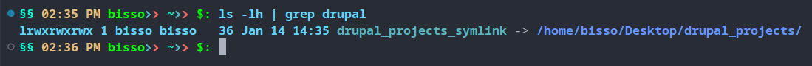
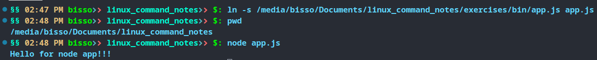

## File

- A container for storing, accessing and/or managing data
- Typically associated with a unique indentifier or filename
- This name, combined with its path, provides a unique location for each file in a filesystem.
- Files can have various attributes:
  - size: the amount of data stored in the file
  - permissions: who can read, write or execute the file
  - ownership: which user and user group owns the file
  - timestamps: when the file was created, last accessed, or modified.

## Symlink

- A symlink (symbolic link) is a special kind of file on Unix systems
- It serves as a reference to another file or directory
- it is a special way of "shortcut" to another diestination
- We create a special file, that contains a reference to the destination path
- This reference is being resolved on access of the symlink
- This affects read and write operations

syntax

`ln -s target link`

- `ln` : stand for link command
- `-s` : options for soft link
- without the `-s` option link will be hard link

```shell
ln -s Desktop/ abc
ls -lh | grep abc
# output: lrwxrwxrwx 1 bisso bisso    8 Jan 14 14:07 abc -> Desktop/
# the first letter "l" indicates that it is a symbolic link
```

```shell
ln -s /home/bisso/Desktop/drupal_projects/ drupal_projects_symlink
ls -lh | grep drupal
```



- `example`
- I have a node app in `/media/bisso/Documents/linux_command_notes/exercises/bin/app.js`, I want to make a symbolic link to that app file from currnet dir (`/media/bisso/Documents/linux_command_notes`) so that I can run the app from current dir.

```shell
ln -s /media/bisso/Documents/linux_command_notes/exercises/bin/app.js app.js
pwd
node app.js
```



### Hard links

- A hardlink is a directory entry or reference to an existing inode
- Technically, the first filename of a file is already a hardlink, but one file can have multiple hardlinks
- Hardlinks behave as if they are the same file
- A hardlink can only link to files on the same filesystem
- The filesystem must support additional hardlinks
- If we delete a hardlink:
  - the other filenames/hardlinks remain intact
  - the data is only deleted if all hardlinks are removed
- hardlinks cannot be created for directories

systax

`ln target hardlink`

```shell
ln /media/bisso/Documents/linux_command_notes/exercises/bin/app.js node_app
```

## Unbuffered input/output

- Directly handles data between the I/O devices and the program
- We get immediate access to the data
- It offiers more precise control over data flow and timing
- Readng data from keyboard.

```shell
sudo cat /dev/input/mics
# move the cursor
```

## Buffered input/Output (I/O)

- Utilizes temporary storage area (buffer) to hold data before it's being recieved or sent to the I/O device
- Reduces the number of I/O operations by accumulating data before processing
- Enhances speed, especially for disk and network operations
- Simplifies the implementation of data integrity checks
- Ideal for large, sequential data transfers
- Examples:
  - Reading file from the disk
  - Writing data to disk in blocks

## Devices

- Everything is a file
- Everyting is a stream of bytes by Linus Torvalds
- Almost all hardware devices are represented as a file
- Through this file, we can enable access to the underlying hardware without knowing its technical details.

- A device refers to a physical or virtual entity that can be accessed through a file-like interface
- Devices in Unix serve as the interface between the operating system and various hardware or virtual components
- They allow applicaions and users to interact with these components by reading from and writing to their corresponding device files.
- There are three types devices
- `Character devices (c):`
- We gain unbuffered, direct access to the hardware
- Usually, we can access those devices by reading a byte (character)
- Though there might be additional restrictins/requirements for certain character devices
- `Block devices (b):`
- We gain beffered access to the hardware
- Multiple bytes are bundled into a bolock
- And we can access this device through accessing those blocks
- `Pseudo devices:`
- Those are devices that don't necessarily refer to a physical device
- Depending on the type, they may show up as a block device or a character device

```shell
ls -lh /dev
# will list all the available devices in linux system, dev short for devices
```

- Some important pseudo devices
- `/dev/null`
  - When we reading from it, returns EOF (end of file)
  - When we are writing on it, it discards the information
- `/dev/random`
  - Produces a stream of random numbers
  - Only produces random data, as long as enough environmental noise is available
- `/dev/urandom`
  - Just as /dev/random, but
  - Always produces data, and may reuse already used environmental noise.
- `/dev/stdout`
- `/dev/stdin`
- `/dev/stderr`

## `/proc`

- containes information about the machine
- `/proc/cpuinfo` : containe info about cup
- `/proc/meminfo` : containe info about memory
- `/proc/version` : container info about system version
- `/proc/uptime` : info about time up and ideal

## Filesystem Hierarchy Standard

- The Filesystem Hierarchy Standard (FHS) defines the directory structure and directory contents in Unix-like operating systems
- It provides a consistent and predictable location for specific types of files and directories
- Ensures compatibility accross different distributions.
- Makes it easier for user, admins and developer to locate files

### `/` : root directory

- all the dirs and files are inside root dir in linux system

### `/bin` : binaries

- containes all the essential binaries of the system
- Nowaday `/bin` might be symLink to `/usr/bin` because of new hierarchy standard

### `/boot`

- containes all configaration for boot

### `/dev` : devices

- containes information about all devices

### `/etc`

- containes system-wide configuration files and dirs
- These files are generally text files that can be edited for system configuration

### `/home`

- containes personal directories for user
- User-specific settings, documents and other files and dirs

### `/lib` : library

- contains library files that supports the binaires located under `/bin` and/or `/sbin`

### `/media`

- contains mount points for removable storage media

### `/mnt` : mount point

- mount points for additional filesystems

### `/opt` : optional

- containes optional binaires which is not part of system binaries
- not much use in debian or censOS base systems but have some use in macOS.

### `/proc` : processes and kernel

- Virtual filesystem which prodives info about processes and the kernel

### `/root`

- containes personal data for the root user

### `/run`

- containes run-time data, means the data required during run time will be strored here
- files will be removed during boot or during shutdown

### `/sbin` : sudo binary

- contains essential biranries usually used by root ruser(sudo)

### `/srv`

- files for services if we don't store in /var
- quite often, data offered by FTP servers

### `/sys` : system

- info about devices, drivers and kernel features

### `/tmp` : temporary

- contains temporary files create by system and users
- these files are typically deleted on reboot

### `/usr`

- contains shareable, read-only data
- this contains system binaries, libraries, documentation, and source-code for various system programs
- usually, this files in this folders could be shared between multiple computers

### `/usr/local`

- this folder is for files that should not be shared bwtween multiple computers

### `/var` : variable

- contains variable data files such as log, databases, websites and email, among other things
- this dir's contents changes as the system runs

### `/lost+found`

- contaies info, if we need to recover our system
