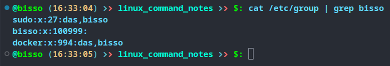
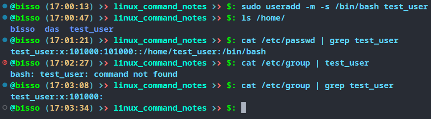
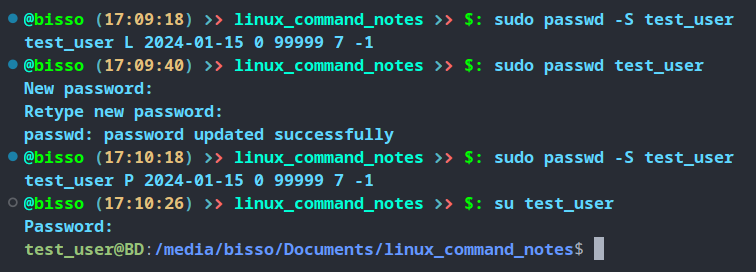
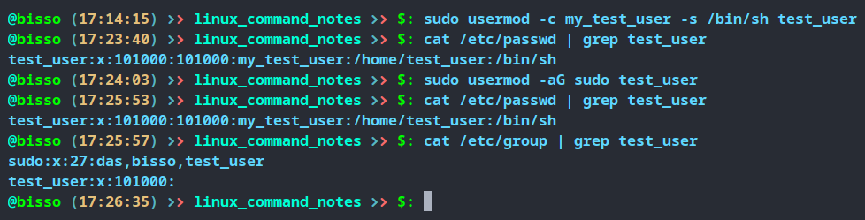
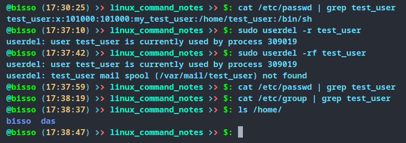
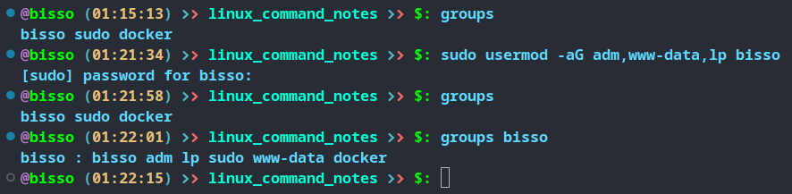
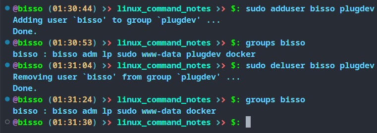

There are several kind of users in linux system

## Root user

- has heighest priveleges
- it has user ID: 0
- there can only be one root user per system

## Regualar users

- has limited previleges
- regular users can get temporary acces to root user through `sudo` command

## Service users

- has previlege for specific tasks
- this allows us to safely ren a webserver, database etc.

## Groups

- all users have a primary group
- each user can be assigned to zero to many additional groups

## `/etc/passwd`

- contains basic user account info such as
  - username
  - groupname
  - user ID (UID)
  - group ID (GID)
  - user description : it's optional, all uer might not have it
  - home directory
  - default shell


## `/etc/shadow`

- it stores encrypted user passwords and passwod againg info
- it also stores additional info such as date of last password changes, expiry datest etc.
- readable only by root users or with `sudo` privilege

## `/etc/group`

- contains info about the groups and their members
- readable by all users



## `useradd`

- we can add user with `useradd` command
  syntax

`useradd [options] [user name]`

options

- `-m` : create home directory, regular user might need a home dir, service user will not need on
- `-d` : to set custom home directory
- `-s` : to specify default shell, by defaul bash is default shell
- `-g` : by default a new group will be created with the same name as the username. with `-g` options we can specify primary group name for the user.
- `-G` : to add user to a secondary groups


a user is created with `test_user` name and home directory and existance of home dir, defauls CLI, groups tested

## `passwd`

- we can add or update password of current user. We can change other user's password if the current user have privileges

syntax

`passwd [options] [user name]`

options

- `-S` : Display password status
- `-d` : Delete password
- `-n` : set minimum password age in days
- `-x` : set maximum password age in days
- `-l` : to lock user account
- `-u` : to unlock user account



- `test_user`'s password status is checked and it is locked (L)
- setting password for test_user with sudo privilege
- checking password staus again, now it is active
- log in as test_user

## `usermod`

- with the usermod command, we can modify another user's details

syntax

`usermod [options] [user name]`

options

- `-c` : to change user description (eg. full name)
- `-s` : to change default shell
- `-d` : to change home directory, installed software might not work
- `-l` : to change username
- `-g` : to change primary group
- `-G` : to change secondary group
- `-aG` : to add secondary group



- test_user's description added and default shell has been changed
- test_user is added to sudo secondary group

## `userdel`

- we can also delete an existing user

syntax

`userdel [option] [user name]`

options

- `-r` : to remove the home directory and mails
- `-f` : force remove of home dir and mails even if the user is logged in



- user, user group and home directory is being deleted

## Groups in linux

- helps to organize users with similar access rights
- simplify permission management
- enhance collaboration and resource sharing
- controlling access to files and directories
- strengthen system security
- each user has a primary, and zero to many secondary groups
  - ### Primary group
    - stored in `/etc/passwd` file
    - default ownership for newly created files
  - ### Secondary group
    - multiple memberships are llowed in secondary group
    - stored in `/etc/group`
    - this allows us to give this user fine grained access rights to our system

## `groups`

- to see all the existing groups

syntax

`groups [user name]`

- if we do not pass any user name, then all grous of current user will be returns
- we can pass multiple user name as arguments

### Some importang froups in linux systems

- `root` : the superuser group with administrative privileges which have complete control over the system
- `sudo` : members can use sudo (administrative privileges) temporarily
- `adm` : allows members to read log files
- `lp` : members may manage printers and print queues
- `www-data` : users have access to web server processes and gives access to web content
- `plugdev` : allows this user to manage pluggable devices (eg, usb sticks, external HDD etc)

## `usermod` : we can use this command also to modify or to add user group

`usermod [options] [user name]`

- `-g` : to change primary group
- `-G` : to change secondary group
- `-aG` : to add secondary group

```shell
groups
sudo usermod -aG adm,www-data,lp bisso
groups bisso
```



## `adduser` : to add a user to a group

`adduser [user name] [group name]`

## `deluser` : to remove a user from a group

`deluser [user name] [group name]`

```shell
sudo adduser bisso plugdev
# adding bisso to plugdev
groups bisso
# checking whether the  group is added
sudo deluser bisso plugdev
# removing bisso from plugdev
groups bisso
# checking whether the group is removed
```


