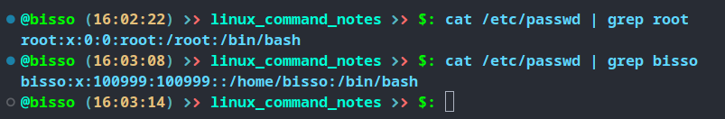

There are several kind of users in linux system

## Root user

- has heighest priveleges
- it has user ID: 0
- there can only be one root user per system

## Regualar users

- has limited previleges
- regular users can get temporary acces to root user through `sudo` command

## Service users

- has previlege for specific tasks
- this allows us to safely ren a webserver, database etc.

## Groups

- all users have a primary group
- each user can be assigned to zero to many additional groups

## `/etc/passwd`

- contains basic user account info such as
  - username
  - groupname
  - user ID (UID)
  - group ID (GID)
  - user description : it's optional, all uer might not have it
  - home directory
  - default shell

## `/etc/shadow`

- it stores encrypted user passwords and passwod againg info
- it also stores additional info such as date of last password changes, expiry datest etc.
- readable only by root users or with `sudo` privilege
