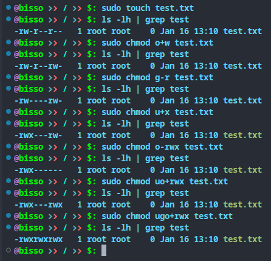
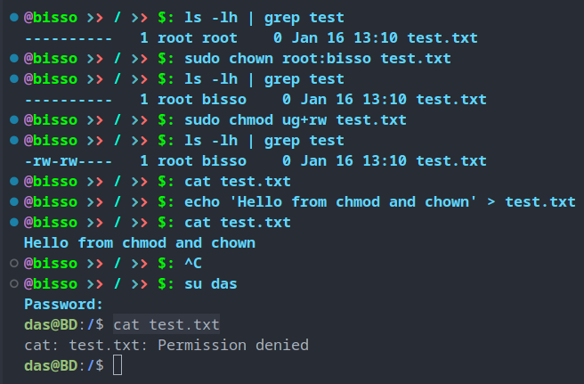

# File permission in Linux

- controls access to files and dirs
- controls who can read, write and execute certain files
- There are three important levels of permissions
  - ## Owner (u)
  - ## Group (g)
  - ## Others (o)
- There are three types of permissions
  - ## Read (r/4)
    - allows only viewing file content or listing dir contents
  - ## Write (w/2)
    - allows write access to file and create/delete access to dir
  - ## Execute (x/1)
    - allows a file to run as a program

## `chmod`

- this command is used to change file permissions

syntax

`chmod [options] [permissions] [file name]`

- `-R` : recursive, change permission for all files and dirs inside dir

```shell
cd /
sudo touch test.txt
ls -lh | grep test
# output: -rw-r--r--
# root has read-wright, group has read, and other user has read rights
# permission is always read-write-execute(rwx) order and - indicates no permission for that place
# first three letters for owner(u), second three letters for group(g) and last three letter for other users (o)
sudo chmod o+w test.txt
# write access is added for other user
sudo chmod g-r test.txt
# write access is removed for group
sudo chmod u+x test.txt
# execute access is added for user
sudo chmod o-rwx test.txt
# we can combine multiple rights togather
sudo chmod uo+rwx test.txt
sudo chmod ugo+rwx test.txt
# we can combine multiple permission with multiple rights
```



## `chown` : change ower

- changes ownership of file or dir

syntax

`chown [options] [uer:group] [file or dir name]`

- `-R` : recursive, change permission for all files and dirs inside dir

```shell
ls -lh | grep test
# checking file permissions and writes
sudo chown root:bisso test.txt
# changing ownership to root user but bisso group, user does not need to be in the group
ls -lh | grep test
# checking permissions, now bisso group owns this file
sudo chmod ug+rw test.txt
# adding read-write rights for user and group
ls -lh | grep test
# checking permissions and writes, user and group have read and write right
echo 'Hello from chmod and chown' > test.txt
cat test.txt
# user bisso from bisso group can read and write
su das
cat test.txt
# tried to read as das user who does not have any permission for this file and permission denied
```


