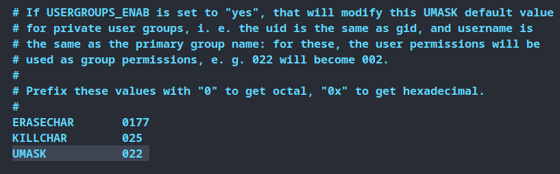

# File permission in Linux

- controls access to files and dirs
- controls who can read, write and execute certain files
- There are three important levels of permissions
  - ## Owner (u)
  - ## Group (g)
  - ## Others (o)
- There are three types of permissions
  - ## Read (r/4)
    - allows only viewing file content or listing dir contents
  - ## Write (w/2)
    - allows write access to file and create/delete access to dir
  - ## Execute (x/1)
    - allows a file to run as a program

## `chmod`

- this command is used to change file permissions

syntax

`chmod [options] [permissions] [file name]`

- `-R` : recursive, change permission for all files and dirs inside dir

```shell
cd /
sudo touch test.txt
ls -lh | grep test
# output: -rw-r--r--
# root has read-wright, group has read, and other user has read rights
# permission is always read-write-execute(rwx) order and - indicates no permission for that place
# first three letters for owner(u), second three letters for group(g) and last three letter for other users (o)
sudo chmod o+w test.txt
# write access is added for other user
sudo chmod g-r test.txt
# write access is removed for group
sudo chmod u+x test.txt
# execute access is added for user
sudo chmod o-rwx test.txt
# we can combine multiple rights togather
sudo chmod uo+rwx test.txt
sudo chmod ugo+rwx test.txt
# we can combine multiple permission with multiple rights
```


## `chown` : change ower

- changes ownership of file or dir

syntax

`chown [options] [uer:group] [file or dir name]`

- `-R` : recursive, change permission for all files and dirs inside dir

```shell
ls -lh | grep test
# checking file permissions and writes
sudo chown root:bisso test.txt
# changing ownership to root user but bisso group, user does not need to be in the group
ls -lh | grep test
# checking permissions, now bisso group owns this file
sudo chmod ug+rw test.txt
# adding read-write rights for user and group
ls -lh | grep test
# checking permissions and writes, user and group have read and write right
echo 'Hello from chmod and chown' > test.txt
cat test.txt
# user bisso from bisso group can read and write
su das
cat test.txt
# tried to read as das user who does not have any permission for this file and permission denied
```


## `chmod` with numbers

`chmod [options] [first digit][second digit][third digit] [file name]`

- `-R`: recursive, change permission for all files and dirs inside dir
- read right has value 4
- write right has value 2
- execute right has value 1
- so all rights value would be 4 + 2 + 1 = 7
- read-write value would be 4 + 2 = 6
- and other possible combinations
- if the total right valu is 0, it means there is no right for this permission

- `first digit` : total right value for user permission
- `second digit` : total right value for group
- `third digit` : total right value for other users

```shell
ls -lh | grep test.txt
# checking current permissions and right
sudo chmod 764 test.txt
# giving permission to owner of all rights, groups of read(4)-write(2) rights and other user of read(4) right
 ls -lh | grep test.txt
# checking permissions and right
```


**_`Note: `_** for directories, if we give only write right we can not create files inside of it, in order to do that we need both write and execute rights.

```shell
mkdir test-dir
ls -lh | grep test-dir
chmod 640 test-dir
# giving user permissions for read-write
ls -lh | grep test-dir
touch test-dir/test.txt
# user have write right but still permission denied because we need execute rite to make a file as touch command will be executed inside this dir
chmod 740 test-dir
# adding execute right to user permission
ls -lh | grep test-dir
touch test-dir/test.txt
ls -lh test-dir/
# finally, we are able to create file inside this dir
```


## `/etc/login.defs`

- we can reconfigure `umask` to set permissions and rights when a new file or directory is created.

```shell
cat /etc/login.defs
```



## `Sticky Bit`

- this permission prevent other users from executing (deleting) folders or files

Syntax

`chmod +t [dir/file name]`

`chmod [0 or 1][u rights value][g rights value][o rights value] [dir/file name]`

- 0 : will turn off sticky bit
- 1 : will turn of sticky bit


- if sticky bit is turn on there will be a (t or T) at the end of the permissions letters (ls -l).
