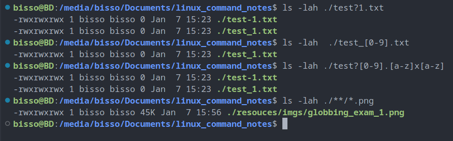

# File management

## `touch`

`touch [file_name]`

```shell
touch test1.txt
```

- create file in current directory with current time stamp if it does not exit already.
- we can create multiple files by passing multiple file names as argument where file names are seperated by a single white space.
- if the file is being created before then `touch` will modify time stamp to current time.

## `mkdir` : make directory

`mkdir [directory name]`

```shell
mkdir test_dir
```

- create directory in current directory
- we can create multiple directories by pasing multiple dir names as argument where dir names are seperated by a single white space.

## `mv` : move

`mv [source path] [destination path]`

- path could be relative or absolute.

```shell
mv ./test1/test_1.txt ./test2/
```

- moves test_1.txt file from ./test1 dir to ./test2 dir.
- we could rename the file name with `mv` command

```shell
mv ./test2/test_1.txt ./test1/test_2.txt
```

- when test_1.txt file will be moved to test1 dir it will be renamed as test_2.txt

```shell
mv ./test1/test_2.txt ./test1/test_1.txt
```

- renaming the file. source and destination dir is same, test_2.txt will be renaimed as test_1.txt

## `cp` : copy

`cp [source path] [destination path]`

- copy file from source to destination
- if we do not give file name in destination path, it will copy as same name as destination

```shell
cp ./test1/test_2.txt ./test2/
```

- if we give different file name at destination path, fill will be copied as destination file name.

```shell
cp ./test1/test_2.txt ./test2/test_3.txt
```

- if we want to copy a dir with content we need to use `-r` (recursive) option to the command.

```shell
cp -r ./test1/ ./test2/
```

## `rm` : remove

`rm [file/dir path]`

- remove file

```shell
rm ./test1/test_2.txt
```

- we can remove multiple files or directories by pasing multiple file or dir names as argument where file or dir names are seperated by a single white space.

```shell
rm ./test2/test_2.txt ./test2/test_3.txt
```

- if we want to remove dir, we need to use `-r` option to the command

```shell
rm -r ./test1 ./test2
```

## `rmdir` : remove directory

`rmdir [dir path]`

- remove only empty dirs

## `*` : Wildcards / Globbing

- `*` represents any number of charectars
- if we write `./moves/*`, it indicates all files and folders in movies dir
- if we write `./movies/*.jpg`, only files with jpg extension will be selected.
- by default hidden files is not selected by `*`, inorder to include the hidden files and folder we need to write `.*`
- globbing can be used all bash commands

```shell
echo *
```

- returns all files and folder names

```shell
echo *.md
```

- returns all files name with `md` extension
- NOTE: if we are use globbing, we can not wrap the `*` into single or double cotes, then that would be consider as strings and bash will not rewrite the command from globbing.

## Advance Globbing Wildcards with `?` `,` `[0-9]` `**`

- `?` can be used to represnt any charecter.

```shell
ls -lah ./test?1.txt
```

- `[0-9]` can be used to represent any charecter from 0 to 9.

```shell
ls -lah  ./test_[0-9].txt
```

- `[a-z]` can be used to represent any charecter from a to z

```shell
ls -lah ./test?[0-9].[a-z]x[a-z]
```

- `**/` allow us to look for the current dir and any child dir
- by default `**` is off, we need to enable it

```shell
shopt -s globstar
```

```shell
ls -lah ./**/*.png
```

- it will return any file with png extention from the current dir and any of it's child dir.



NOTE: it's always a best practice to us `./` before file or dir name to address from current dir when useing globbing, it will prevent many pitfalls of globbing

## `find` : program to find files and dirs

`find [path]`

- retuns a list of files and dirs in the path
- it has many options which can be used to filter down the search result
- `-type f` for only files
- `-type d` for only dirs
- `-size +1M` filter only size more than 1MB
- `-empty` filters only empty files or dirs
- `-executable` filters only executable files
