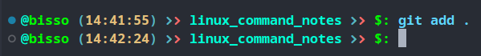

## EVN: PS1 : Prompt String 1

- throw `PS1` we can customize the string in the prompt at the most left before inputting any command.

```shell
PS1='Bisso PC #'
```

we can access certain information inside `PS1` string via special carecters.

- `\u` : returns current user
- `\h` : returns host name in short
- `\H` : returns host name in detail
- `\W` : returns last dir in pwd
- `\w` : returns full pwd
- `\t` : returns time in 24h formate
- `\@` : returns time in 12h formate

```shell
PS1='\w$ '
```

- to make the change parmanent, we need to add this line to `.bashrc` file

## `TERM` : ENV for color in terminal

```shell
echo "${TERM}"
# output: xterm-256color
```

## Changing prompt string color

`echo -e "\e[[foreground_color_number];[background_color_number]m`

- `-e` : to enable the especial charecter reading mode
- `\e` : special charecter for escaping the next charecter
- foreground and background color are given as number and seperated by semicolon (`;`)
- `m` : must needed charecter to indicate end

```shell
echo -e "\e[36;40m"
```

## `infocmp` : returns all the available escape sequences

```shell
echo -e "\e[1m"
```

- makes text bold

```shell
echo -e "\e(B\e[m"
```

- reset to default

## Command substitutions in Bash

`command "$([substitute command])"`

```shell
echo "output from ls: $(ls -lah)"
echo "$(cat ./1_terminal_basic.md) $(./2_Linux_basics.md)"
```

## `tput` : generate escape sequence

`tput [options]`

- `smul` : start underline text
- `rmul` : end underline text
- `setaf [color]` : set foreground color
- `setab [color]` : set background color
- `bold` : makes str bold
- `sgr0` : reset to default

```shell
tput bold
```

```shell
tput sgr0
```

```shell
tput setaf 33
# change str color to cyan color
```

if we want ot use `tput` command as substitue command, the proper way of doing it

```shell
\[$(tput bold)\]
```

if we do not wrap the `tput` substitue command inside `\[ \]`, it mess up with charecter count of bash

```shell
PS1='\[$(tput setaf 50)$(tput bold)\]§§\[$(tput setaf 3)\](\@)\[$(tput setaf 46)\]\u\[$(tput setaf 7)\]𐣼\[$(tput setaf 1)\]𐣼\[$(tput setaf 50)\] \W\[$(tput setaf 7)\]𐣼\[$(tput setaf 1)\]𐣼\[$(tput setaf 46)\] $: \[$(tput sgr0)\]'
```


```shell
PS1='\[$(tput setaf 50)$(tput bold)\]§§ \[$(tput setaf 5)\]\@ \[$(tput setaf 46)\]\u\[$(tput setaf 6)\]𐣼\[$(tput setaf 1)\]𐣼\[$(tput setaf 50)\] \W\[$(tput setaf 6)\]𐣼\[$(tput setaf 1)\]𐣼\[$(tput setaf 46)\] $: \[$(tput setaf 81)\]'
```


```shell
PS1='\[$(tput setaf 50)$(tput bold)\]@\[$(tput setaf 46)\]\u\[$(tput setaf 6)\] (\[$(tput setaf 3)\]\t\[$(tput setaf 6)\]) \[$(tput setaf 6)\]𐣼\[$(tput setaf 1)\]𐣼\[$(tput setaf 50)\] \W \[$(tput setaf 6)\]𐣼\[$(tput setaf 1)\]𐣼\[$(tput setaf 46)\] $: \[$(tput setaf 81)\]'
```


