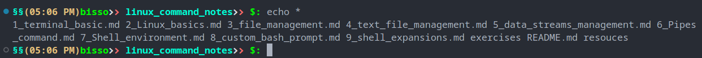
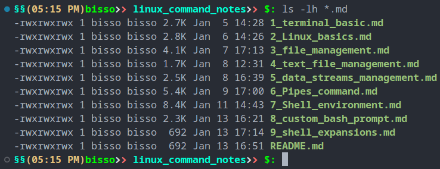
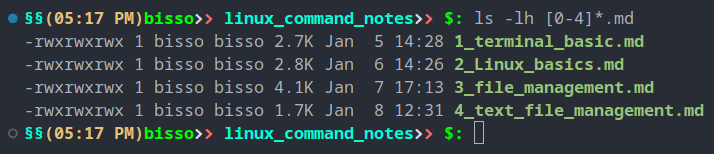
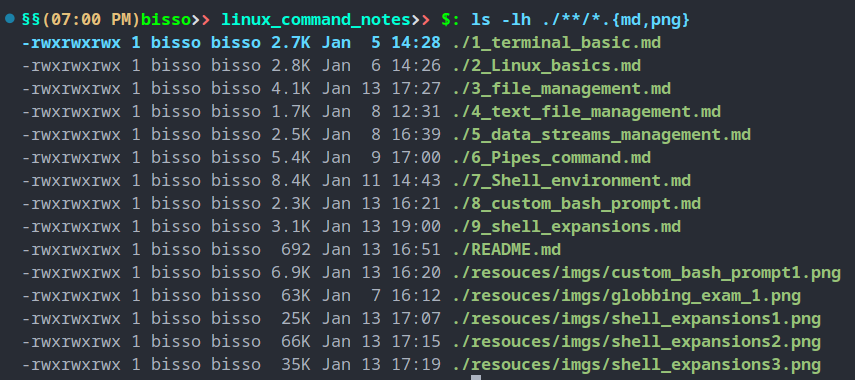

# Shell expansions

- Before executing, the shell "rewrites" and parses the command
- This happens before the command is being executed

## `*`: File name expansions

- instead of passing each and every file and dir name into a command, we can use `*` which first get expanded into all avilable fire and dir then run the command.

```shell
echo *
```

- first `*` will be expanded into all available files and dir name, then everything will be printed in the console.
  

```shell
ls -lh *.md
```

- will return only files with `.md` extension, however file name can be anything
  

```shell
ls -lh [0-4]*.md
```

- will return only files stars with a number from 0 to 4, restpart of the name can be anything but have to be `.md` extension
  

## `~` : expands to to `HOME ENV`

```shell
echo ~
# output : /home/bisso
```

- `~+` : works as pwd

```shell
echo ~+
# output: /media/bisso/Documents/linux_command_notes
```

## Variable and parameter expansions

- `$variable_name`
- `${variable_name}`
- `"$variable_name"`
- `"${variable_name}"`
  examples

```shell
echo $HOME
echo ${HOME}
echo "$HOME"
echo "${HOME}"
```

- Bash rewrites the command for us and fills in the variable with actual values
- We should prefer to use double quotes around and whould use curly brackets to clearly indicates that we are using variable expansions

## Shell parameter expansion

- Shell parameter expansion allows us to work with strings
- However, we need to have a variable first.
- `${#var_name}`: returns charecters

```shell
name='Bishwajit Das'
echo "${#name}"
# output: 13
```

- `${var_name:start:lenght}` : cut out a substring

```shell
echo "${name:0:5}"
# output: Bishw
```

- `${var_name/pattern/replacement}` : replaces the pattern with replacement for the first occurance

```shell
echo "${name/a/*}"
# output : Bishw*jit Das
```

- `${var_name//pattern/replacement}` : replaces the pattern with replacement for all occurances

```shell
echo "${name//a/*}"
# output : Bishw*jit D*s
```

## use of quotes and it's significance

- `no quote` : all available shell expansions are being applied

```shell
echo *.md
```

- `''` : all expansions and word splitting are disabled

```shell
ls '*.md'
# output: *.md
```

- `""` : most of the expansing (eg. \*, ~) and word splitting are disable, but variable and parameter expansions are still working.

```shell
echo "*.md"
# file expansion does not work
# output: *.md
echo "$HOME"
# output: /home/bisso
```

## `\` : Escaping

- Sometimes we want t disable Bash from performing the default actions
- It disables the normal behavior of the next character
- `cat a\ file.txt` : after "a" there is a space , by default there shoud be a word splitting but because of "\" world splittingis disabled.

## `{value1,value2...}` : Bracce expansions

- use to filter multiple files or dirs
- `Note`: there should not be any space between values but seperated by comma(,).

```shell
ls -lh ./**/*.{md,png}
```

- all the files with extension `md and png` from current and child dirs will be listed
  

- `{start_value..end_value}` : we can expand a range of vale

```shell
echo {a..z}
# brace will expands to letters from a to z
echo {1..10}
# brace will expands to number 1 to 10
touch 'test'{1..10}.txt
# create test1.txt .... test10.txt files
rm ./test*.txt
# removes all the files that were being created in previous command
```

## Command substitution

`command1 "$(command 2)"`

- command 2 will be executed first then that will be used in command 1
- we can also execute a command and use the output as a replacement

```shell
echo "$(ls -lh ~)"
```

## Process substitution

`<(command)`

- Process substitution allows us to use the input or the output of a process as temporary file
- it creates a temporary file which we can use argument for other program
- the temporary files get deleted when the process ends.

```shell
diff <(ls ~) <(ls $(pwd))
```

```shell
wc -l < <(ls $(pwd))
```
